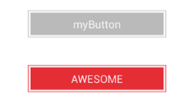

# LibWidget Examples

[](http://choosealicense.com/licenses/apache-2.0/)

Quick examples of the library [libwidget](https://github.com/TheSmiths/libwidget). 

## Button Widget
See the source code of
[button.widget](https://github.com/TheSmiths/libwidgetExamples/tree/master/app/widgets/button.widget)

In button.widget's controller : 
```javascript
var widgetBuilder = require("libwidget/libWidget").newBuilder(this);

_.extend(this, {
    construct: function (config) {
        widgetBuilder.addRules({
            title: "#label.text",
            type: function (value) {
                var changeColor = function (color) {
                    widgetBuilder.setProperty("#outer", "backgroundColor", color);
                    widgetBuilder.setProperty("#inner", "backgroundColor", color);
                }
                switch(value) {
                    case "primary": changeColor("#1DB7FF"); break;
                    case "cancel": changeColor("#E52D35"); break;
                    default: changeColor("#BABABA");
                }
            }
        }).build(config);
    }
});
```
and, the related TSS in the app `.tss` file :
```css
"#button1": {
    top: 100,
    title: "AWESOME",
    type: "cancel"
},

"#button2": {
    top: 20,
    type: "ThisTypeDoesntExist"
}
```




